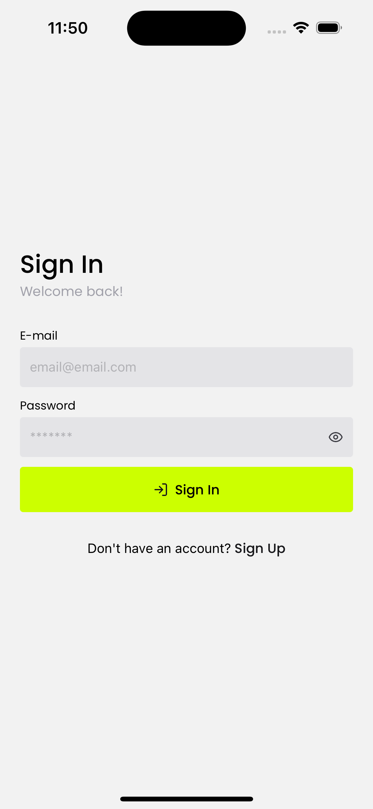
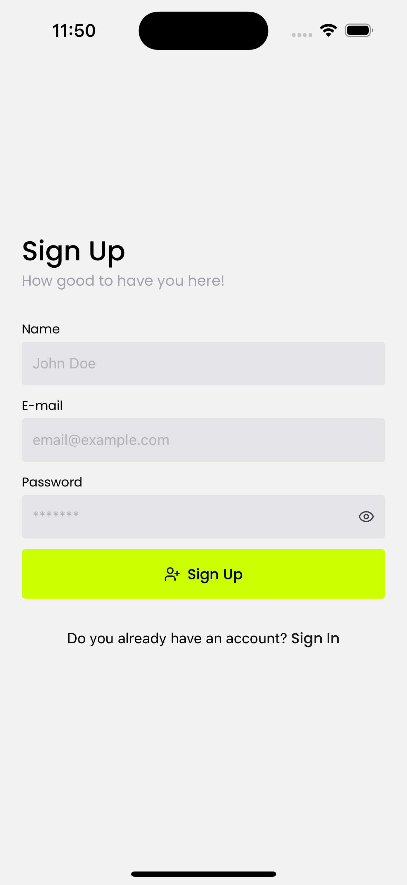
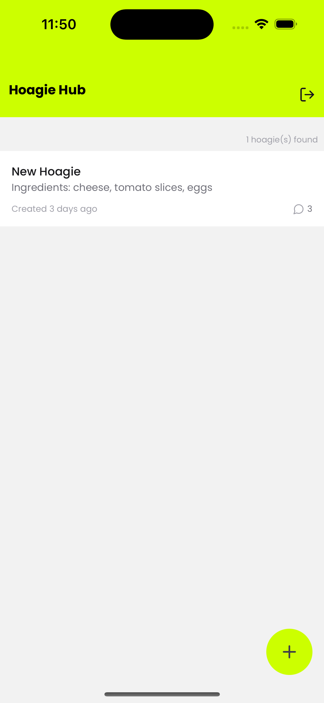
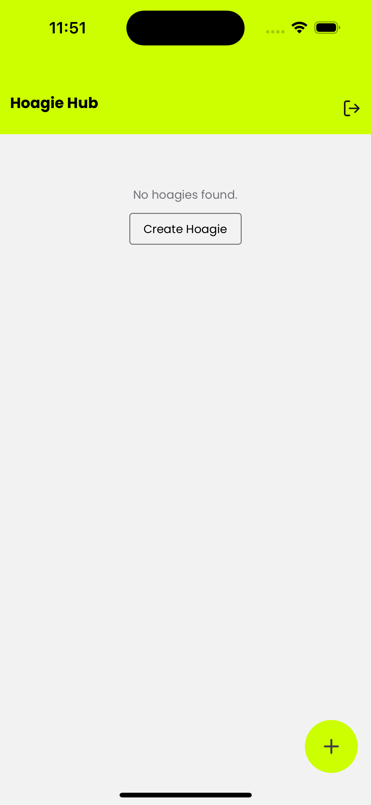
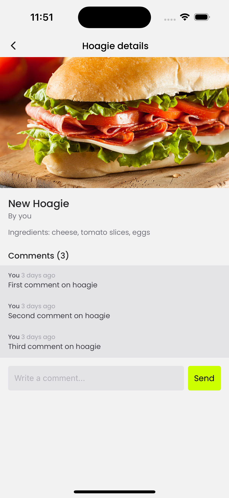
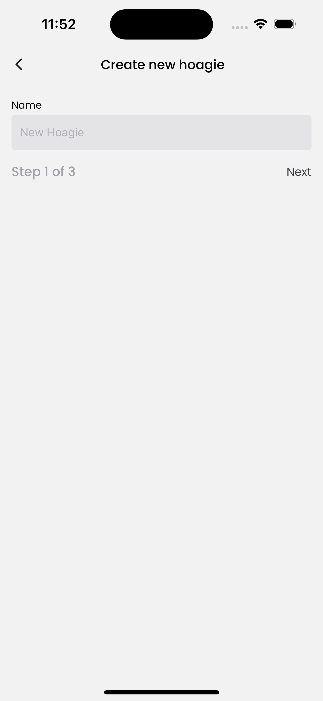
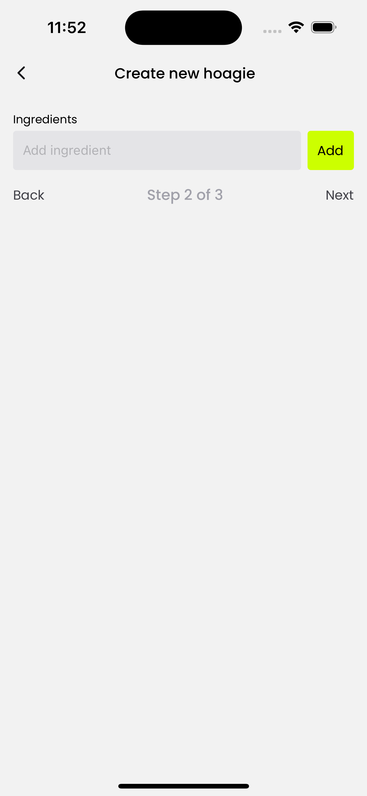
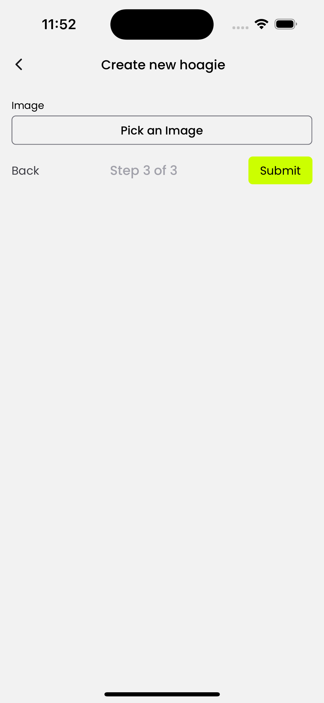

# Hoagie Hub 🥪

A mobile-first collaborative platform where users can create, customize, comment on, and share sandwich ("hoagie") recipes. Built with a modular and scalable architecture using **NestJS**, **MongoDB**, and **React Native (Expo)**.

---

## Table of Contents

- [Features](#features)
- [Tech Stack](#tech-stack)
- [Architecture](#architecture)
- [Backend Setup (Nestjs)](#backend-setup-nestjs)
- [Frontend Setup (React Native)](#frontend-setup-react-native)
- [Database (MongoDB)](#database-mongodb)
- [API Overview](#api-overview)
- [Rate Limiting](#rate-limiting)
- [Next Steps](#next-steps)

---

## Features

### User

- Sign up / login (JWT token)

### Hoagie

- Create hoagies (name, ingredients, image as Base64)
- View paginated hoagie list with total count
- View hoagie details
- View number of comments per hoagie

### Comments

- Add comment to a hoagie
- View all comments for a hoagie

---

## Tech Stack

### Backend

- **NestJS**
- **MongoDB** via **Mongoose**
- **Throttler** (rate limiting)
- **Zod** (validation)
- **Docker Compose** (Mongo container)

### Frontend

- **React Native (Expo)**
- **TypeScript**
- **React Navigation**
- **TanStack Query**
- **NativeWind**
- **React Hook Form**

---

## Architecture

### Backend Principles:

- Clean Architecture & DDD structure
- Domain entities & repositories
- Infrastructure adapters (Mongoose)
- Application use cases
- Controllers (routes)

### MongoDB:

- Hoagie, Comment, and User schemas
- Virtual population & aggregation for computed fields like `commentCount`

---

## Backend Setup (NestJS)

⚠️ Make sure you have Node.js (v20 or above) installed.

```bash
# Clone the repository
git clone https://github.com/felipesilvadev/barosa-hoagie-hub.git

# Go to the folder
cd barosa-hoagie-hub/api

# Install dependencies
npm install

# Setup MongoDB with Docker Compose
docker-compose up -d

# Start development server
npm run start:dev
```

### Environment Variables

Copy `.env.example` file and rename to `.env`:

Fullfil the empty values:
```
JWT_PRIVATE_KEY=""
JWT_PUBLIC_KEY=""
```

---

## Frontend Setup (Mobile)

```bash
# Go to the mobile project's folder
cd ../mobile

# Install dependencies
npm install

# Start metro bundle
npm start
```

- 💡 Open the application on your iOS simulator by pressing the letter I or on Android emulator by pressing the letter A
---

## Database (MongoDB)

### Models:

#### User

```ts
- name: string
- email: string
- password: string
```

#### Hoagie

```ts
- name: string
- ingredients: string[]
- picture?: string (Base64)
- creatorId: User reference
- createdAt, updatedAt: Date
```

#### Comment

```ts
- text: string
- userId: User reference
- hoagieId: Hoagie reference
- createdAt: Date
```

---

## API Overview

### Endpoints

#### User
```
POST /accounts                      # Create new user account
POST /sessions                      # Authenticate
```

#### Hoagies

```
GET /hoagies?page=1                # Paginated list + commentCount
GET /hoagies/:id                   # Full hoagie info + creator + comments
GET /hoagies/by-user               # User's own hoagies
POST /hoagies                      # Create new hoagie
```

#### Comments

```
POST /comments                     # Add comment to hoagie
```

---

## Rate Limiting

Implemented via [`@nestjs/throttler`](https://docs.nestjs.com/security/rate-limiting):

Global guard is applied to protect endpoints. Custom `@Throttle(limit, ttl)` can be used per route.

---

## Screenshots

#### Sign In and Sign Up

<p style="display: flex; flex-direction: row; gap: 16px;">
  
  
</p>

#### Hoagies list and details

<p style="display: flex; flex-direction: row; gap: 16px;">
  
  
  
</p>

#### Creation of new hoagie

<p style="display: flex; flex-direction: row; gap: 16px;">
  
  
  
</p>

---

## Next Steps

### Backend

- ✅ Unit tests with **Vitest**
- ✅ API documentation with **Swagger** (via `@nestjs/swagger`)
- ✅ Real-time features with **WebSockets** for new hoagies and comments
- ✅ Add **collaborators** support to the Hoagie schema (multiple users per hoagie)

### Frontend

- ✅ Unit and E2E tests using **Jest** and **React Native Testing Library**
- ✅ Real-time support with **Socket.IO**
- ✅ Improve UX with **animations** and **gesture handling**
- ✅ Add **user search and invite** flow to collaborate on hoagies

---
